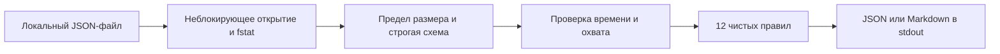

# Архитектура локального аудитора

Назначение — объяснимый аудит нормализованных метаданных Azure/Entra только чтением. В MVP нет средства облачного сбора, HTTP API, сервера, базы, планировщика или автоматического исправления. Реализованный поток:

## Компоненты и ответственность

| Компонент | Файл | Ответственность |
|---|---|---|
| CLI | azure_opsec_auditor/cli.py | аргументы, русская справка, stdout/stderr и код завершения |
| Схема/загрузка | azure_opsec_auditor/schema.py | regular file, 5 MiB, UTF-8, запрет дубликатов, типы/пределы/UTC |
| Каталог | azure_opsec_auditor/catalog.py | поля, условия риска, severity, описания, remediation и ограничения |
| Движок | azure_opsec_auditor/engine.py | полные/неполные записи, возраст, findings и coverage; без изменения снимка |
| Установка/пакеты | scripts/install.sh, scripts/verify_distribution.py | установка с нуля, тесты, изолированная проверка wheel/sdist и удаления |
| Контроль выпуска | scripts/publish_release.py | соответствие tag/commit/version, неизменность assets, скачивание/SHA256 |

## Контракты данных

Источник — доверенный операторский файл, а не независимое доказательство live tenant. `scope`, `complete`, privilege и trust flags являются утверждениями нормализации. Коллекция partial даёт отдельный unknown по охвату; известные записи могут иметь собственный pass/fail. Пустая complete не доказывает отсутствие риска. Пропущенный раздел означает not_run; missing/null поля — unknown.

`collected_at` относится ко всему снимку: при объединении разных наблюдений берётся самое раннее время. Возраст по умолчанию 7 дней, допустимы 1–365. Будущая дата — ошибка; `--as-of` задаёт воспроизводимую историческую оценку, но не делает реальные данные свежими. Результаты сортируются в стабильном порядке, evidence содержит только признанные поля. Русские описания не меняют JSON-ключи/enum.

## Границы и развитие

Принимаются только regular files; FIFO/device/directory отвергаются до чтения, fd закрывается при успехе и ошибке. Ввод не исполняет код, отчёт не пишет файлы. ОС и оператор отвечают за права, приватное хранение и перенаправление stdout. Сканер сигнатур не гарантирует анонимность.

Будущий Graph/ARM слой должен быть отдельным адаптером с явным tenant/subscription scope, поддерживаемой auth, minimally scoped grants, host/verb/nextLink guards и bounded pagination/retries. Он **не реализован**. Реальные CA coverage, group/custom-role expansion, network reachability, telemetry delivery и restore требуют лаборатории, а не вывода из полей MVP.

Подробная сохранённая спецификация: [docs/03-architecture.md](docs/03-architecture.md). Фактический контракт: [CORE-CONTRACT.md](CORE-CONTRACT.md); угрозы: [THREAT-MODEL.md](THREAT-MODEL.md).
